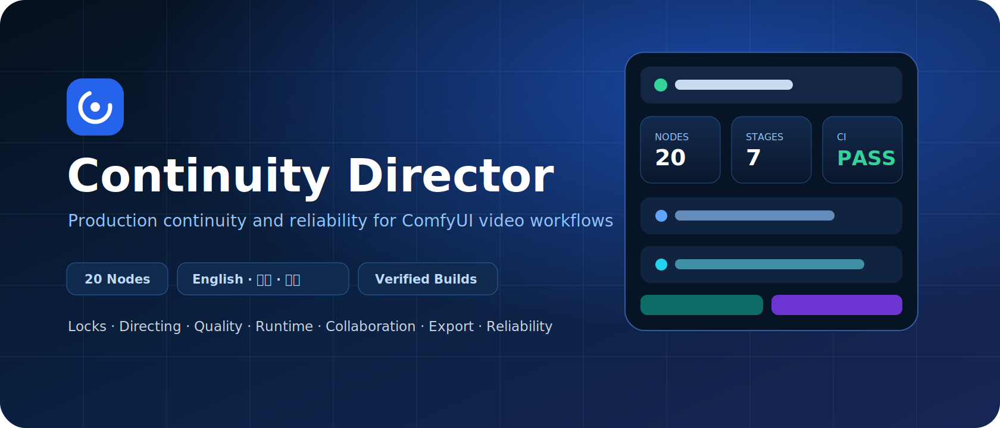
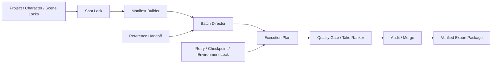

<p align="center">
  
</p>

<p align="center"><strong>Deterministic continuity planning, quality control, and production reliability for ComfyUI video workflows.</strong></p>

<p align="center">
  <a href="https://github.com/xinjian0101/continuity-director/actions/workflows/ci.yml"></a>
  <a href="https://github.com/xinjian0101/continuity-director/releases"></a>
  
  
  <a href="https://github.com/xinjian0101/continuity-director/stargazers"></a>
  <a href="https://github.com/xinjian0101/continuity-director/issues"></a>
  
  <a href="LICENSE"></a>
</p>

# Continuity Director

Continuity Director is a public, installable ComfyUI custom-node package for repeatable AI video production. It turns project rules, identity constraints, scenes, shots, references, quality metrics, execution dependencies, retries, checkpoints, approvals, and export state into structured production data.

> [!IMPORTANT]
> Continuity Director does not replace a video model and cannot guarantee pixel-perfect identity. It makes continuity decisions, failures, and handoffs inspectable and reproducible.

## Project stewardship

| Item | Status |
|---|---|
| Repository visibility | Public |
| Primary maintainer | [@xinjian0101](https://github.com/xinjian0101) |
| Maintenance model | Active maintainer-led open source |
| Current release | [`v0.8.42`](https://github.com/xinjian0101/continuity-director/releases) maintained preview |
| Latest maintenance | 20 sequential hardening iterations covering validation, scheduling, retries, checkpoints, hashing, packaging, and frontend rollback |
| Maintenance evidence | [v0.8.42 iteration log](docs/ITERATION_LOG_v0.8.42.md) |
| Governance | [GOVERNANCE.md](GOVERNANCE.md) |
| Maintainers | [MAINTAINERS.md](MAINTAINERS.md) |
| Roadmap | [ROADMAP.md](ROADMAP.md) |
| Release process | [docs/RELEASING.md](docs/RELEASING.md) |
| Security | [SECURITY.md](SECURITY.md) |
| Adoption evidence | [docs/ADOPTION.md](docs/ADOPTION.md) |

Public Issues, pull requests, CI, changelog entries, automatic release publication, scheduled health checks, and Dependabot updates provide verifiable maintenance evidence.

## What v0.8.42 hardens

- Whitespace and malformed JSON input handling.
- Collection normalization, deduplication, and path-ignore behavior.
- Manifest, storyboard, seed, duration, Take, and dependency validation.
- Finite-safe quality scoring and retry schedules.
- Deterministic execution plans and order-preserving checkpoints.
- Deletion-aware three-way merge diagnostics.
- Stable no-op migrations and explicit hash verification reasons.
- Canonical environment locks and reproducible, symlink-safe ZIP output.
- Stronger release validation and rollback-safe frontend node creation.

## Production workflow



The dashboard action **Add starter chain** inserts and connects the primary production path using a size-aware layout and rolls back partial creation failures.

## Node map

| Stage | Nodes | Purpose |
|---|---:|---|
| Continuity locks | 5 | Project, character, scene, shot, and manifest state |
| Directing | 2 | Storyboard expansion and reference handoff |
| Quality | 3 | Thresholds, Take ranking, and continuity comparison |
| Runtime and collaboration | 3 | Execution planning, audit events, and merge |
| Export | 1 | Portable verified production package |
| Reliability | 6 | Verification, migration, retries, checkpoints, idempotency, and environment lock |

<details>
<summary><strong>Complete 20-node catalog</strong></summary>

`CDProjectLock`, `CDCharacterLock`, `CDSceneLock`, `CDShotLock`, `CDManifestBuilder`, `CDBatchDirector`, `CDReferenceHandoff`, `CDQualityGate`, `CDTakeRanker`, `CDContinuityReport`, `CDExecutionPlan`, `CDAuditEvent`, `CDThreeWayMerge`, `CDExportPackage`, `CDVerifyPackage`, `CDMigratePayload`, `CDRetryPolicy`, `CDQueueCheckpoint`, `CDIdempotencyKey`, `CDEnvironmentLock`.

</details>

## Installation

### Git

From `ComfyUI/custom_nodes`:

```bash
git clone https://github.com/xinjian0101/continuity-director.git ComfyUI-ContinuityDirector
```

Restart ComfyUI, then search for nodes beginning with `CD ·` or open the **Continuity Director** sidebar.

### Release ZIP

Download `continuity-director-v0.8.42.zip` and its checksum from [GitHub Releases](https://github.com/xinjian0101/continuity-director/releases). Extract the included `ComfyUI-ContinuityDirector` folder into `ComfyUI/custom_nodes`, then restart ComfyUI.

### Update

```bash
cd ComfyUI/custom_nodes/ComfyUI-ContinuityDirector
git pull
```

### Build locally

```bash
python scripts/build_release.py
```

Output: `dist/continuity-director-v0.8.42.zip`.

## First production run

1. Open the Continuity Director sidebar.
2. Select English, 中文, or bilingual mode.
3. Click **Add starter chain**.
4. Configure Project, Character, Scene, and Shot locks.
5. Build a manifest and provide storyboard JSON to Batch Director.
6. Generate an execution plan.
7. Apply quality and reliability nodes before export.

Example inputs are available in [`examples/`](examples/).

## Validation

```bash
python -m compileall -q .
python scripts/smoke_import.py
python scripts/maintainer_health.py
PYTHONPATH=tests python -m unittest discover -s tests -p "test_*.py"
python scripts/validate_release.py
python scripts/build_release.py --check
node tests/frontend_smoke.mjs
node tests/reliability_frontend_smoke.mjs
```

## Documentation

- [Documentation hub](docs/README.md)
- [20-iteration maintenance log](docs/ITERATION_LOG_v0.8.42.md)
- [Architecture](docs/ARCHITECTURE.md)
- [Interface and localization](docs/INTERFACE.md)
- [Ecosystem value](docs/ECOSYSTEM.md)
- [Adoption evidence](docs/ADOPTION.md)
- [Release process](docs/RELEASING.md)
- [Administrator setup](docs/ADMIN_SETUP.md)
- [Maintainers](MAINTAINERS.md)
- [Governance](GOVERNANCE.md)
- [Roadmap](ROADMAP.md)
- [Contributing](CONTRIBUTING.md)
- [Security](SECURITY.md)
- [Support](SUPPORT.md)
- [Changelog](CHANGELOG.md)

## Compatibility and security

- Python 3.10–3.12 is tested in CI.
- Imported JSON is declarative data and is not executed.
- Production packages must not contain credentials.
- Integrity hashes detect changes; they do not provide authorization.
- External models, operating systems, ComfyUI installations, and third-party nodes remain separate trust boundaries.

## Contributing

Bug reports, compatibility reports, adoption reports, documentation fixes, and focused feature proposals are welcome. Review [CONTRIBUTING.md](CONTRIBUTING.md) and [CODE_OF_CONDUCT.md](CODE_OF_CONDUCT.md), then use the structured [Issue forms](https://github.com/xinjian0101/continuity-director/issues/new/choose).

## License

Released under the [MIT License](LICENSE).
