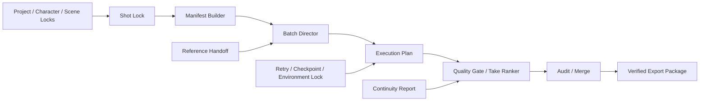

<p align="center">
  
</p>

<p align="center">
  <strong>Deterministic continuity planning, quality control, and production reliability for ComfyUI video workflows.</strong>
</p>

<p align="center">
  <a href="https://github.com/xinjian0101/continuity-director/actions/workflows/ci.yml"></a>
  
  
  
  
  <a href="LICENSE"></a>
</p>

<p align="center">
  <a href="#why-continuity-director">Why</a> ·
  <a href="#production-workflow">Workflow</a> ·
  <a href="#node-map">Nodes</a> ·
  <a href="#installation">Install</a> ·
  <a href="#documentation">Docs</a> ·
  <a href="https://github.com/xinjian0101/continuity-director/issues/new/choose">Report an issue</a>
</p>

---

# Continuity Director

Continuity Director is an installable ComfyUI custom-node package for repeatable AI video production. It converts project rules, identity constraints, scenes, shots, references, quality metrics, execution dependencies, approvals, retry plans, checkpoints, environment records, and export state into structured, traceable production data.

> [!IMPORTANT]
> Continuity Director does not replace a video model and cannot guarantee pixel-perfect identity. It controls production inputs and decisions so drift, failed handoffs, and inconsistent runs can be detected and corrected systematically.

## Why Continuity Director

| Production problem | Continuity Director response |
|---|---|
| Character or wardrobe drift | Explicit character locks, reference records, and continuity comparison |
| Inconsistent shots | Scene and shot locks with deterministic manifests |
| Too many uncontrolled generations | Storyboard-to-Take expansion, quality gates, and weighted ranking |
| Failed long-running batches | Dependency-safe execution waves, retry policy, and resumable checkpoints |
| Difficult collaboration | Audit events, revision-safe three-way merge, and portable packages |
| Non-reproducible environments | Runtime environment locks, integrity hashes, and idempotency keys |
| Unclear production state | Native dashboard, reliability sidebar, and structured JSON outputs |

## At a glance

| Capability | Included in v0.8.20 |
|---|---|
| ComfyUI nodes | 20 registered nodes across 7 production stages |
| Interface | Native production dashboard and reliability sidebar |
| Languages | English, Simplified Chinese, and bilingual display modes |
| Workflow acceleration | One-click connected starter chain |
| Reliability | Hash verification, schema migration, retry policy, checkpoints, and environment locks |
| Validation | Python 3.10–3.12 CI, lifecycle smoke tests, unit tests, frontend tests, and ZIP validation |
| Runtime dependencies | No mandatory third-party Python packages |

## Production workflow



The dashboard action **Add starter chain** inserts and connects the primary production path automatically.

## Node map

<details open>
<summary><strong>Continuity locks — 5 nodes</strong></summary>

| Node | Purpose |
|---|---|
| `CDProjectLock` | Project title, aspect ratio, FPS, language, and production notes |
| `CDCharacterLock` | Appearance, wardrobe, prohibited changes, references, and identity seed |
| `CDSceneLock` | Location, time, lighting, palette, and environment state |
| `CDShotLock` | Prompt, camera, duration, seed, and continuity context |
| `CDManifestBuilder` | Portable deterministic production manifest |

</details>

<details>
<summary><strong>Directing — 2 nodes</strong></summary>

| Node | Purpose |
|---|---|
| `CDBatchDirector` | Expand storyboard JSON into deterministic Take variants |
| `CDReferenceHandoff` | Record reference transfer between adjacent shots |

</details>

<details>
<summary><strong>Quality — 3 nodes</strong></summary>

| Node | Purpose |
|---|---|
| `CDQualityGate` | Evaluate metrics against declared thresholds |
| `CDTakeRanker` | Rank Takes with deterministic weighted scoring |
| `CDContinuityReport` | Compare JSON state and report exact changed paths |

</details>

<details>
<summary><strong>Runtime, collaboration, and export — 4 nodes</strong></summary>

| Node | Purpose |
|---|---|
| `CDExecutionPlan` | Build dependency-safe parallel execution waves |
| `CDAuditEvent` | Append a hash-linked production audit event |
| `CDThreeWayMerge` | Merge revisions and report exact conflict paths |
| `CDExportPackage` | Produce a hashed portable production package |

</details>

<details>
<summary><strong>Reliability — 6 nodes</strong></summary>

| Node | Purpose |
|---|---|
| `CDVerifyPackage` | Verify package integrity without executing imported data |
| `CDMigratePayload` | Update schema version markers and regenerate hashes |
| `CDRetryPolicy` | Create a bounded deterministic retry schedule |
| `CDQueueCheckpoint` | Record completed, failed, and remaining tasks |
| `CDIdempotencyKey` | Generate stable keys for duplicate-request detection |
| `CDEnvironmentLock` | Record ComfyUI, frontend, Python, platform, and model environment |

</details>

## Installation

From `ComfyUI/custom_nodes`:

```bash
git clone https://github.com/xinjian0101/continuity-director.git ComfyUI-ContinuityDirector
```

Restart ComfyUI, then search for node names beginning with `CD ·` or open the **Continuity Director** sidebar.

### Update an existing installation

```bash
cd ComfyUI/custom_nodes/ComfyUI-ContinuityDirector
git pull
```

### Build an installable ZIP

```bash
python scripts/build_release.py
```

The archive is created at `dist/continuity-director-v0.8.20.zip`.

## First production run

1. Open the **Continuity Director** sidebar.
2. Select English, 中文, or bilingual mode.
3. Click **Add starter chain**.
4. Configure Project, Character, Scene, and Shot locks.
5. Build a manifest and provide storyboard JSON to Batch Director.
6. Generate an execution plan.
7. Apply quality and reliability nodes before exporting the package.

Example input files are available in [`examples/`](examples/).

## Validation

Run the same core checks used by GitHub Actions:

```bash
python -m compileall -q .
python scripts/smoke_import.py
PYTHONPATH=tests python -m unittest discover -s tests -p "test_*.py"
python scripts/validate_release.py
python scripts/build_release.py --check
node tests/frontend_smoke.mjs
node tests/reliability_frontend_smoke.mjs
```

## Documentation

| Document | Purpose |
|---|---|
| [Documentation hub](docs/README.md) | Entry point for users and contributors |
| [Architecture](docs/ARCHITECTURE.md) | Modules, data flow, and execution boundaries |
| [Interface rules](docs/INTERFACE.md) | Dashboard behavior and localization requirements |
| [Contributing](CONTRIBUTING.md) | Development workflow and pull-request checklist |
| [Security policy](SECURITY.md) | Supported versions and vulnerability reporting |
| [Support](SUPPORT.md) | Installation and troubleshooting guidance |
| [Changelog](CHANGELOG.md) | Release history |

## Repository structure

```text
continuity-director/
├── nodes.py                    # Core ComfyUI nodes
├── extended_nodes.py           # Reliability nodes
├── environment_nodes.py        # Environment lock node
├── *_core.py                   # Deterministic data and execution logic
├── js/                         # Dashboard, reliability sidebar, styles, and help pages
├── examples/                   # Starter production inputs
├── tests/                      # Backend and frontend regression tests
├── scripts/                    # Validation and release builders
├── docs/                       # Architecture and interface documentation
└── .github/                    # CI and contribution templates
```

## Compatibility and security

- Python 3.10–3.12 is tested in CI.
- Imported JSON is treated as declarative data and is not executed.
- Production packages must not contain API keys or credentials.
- Integrity hashes detect changes; they are not an access-control mechanism.
- External models, operating systems, ComfyUI installations, and third-party nodes remain separate trust boundaries.

## Contributing

Bug reports, workflow compatibility reports, documentation fixes, and focused feature proposals are welcome. Start with the [contributing guide](CONTRIBUTING.md) and use the structured [issue forms](https://github.com/xinjian0101/continuity-director/issues/new/choose).

## License

Released under the [MIT License](LICENSE).
