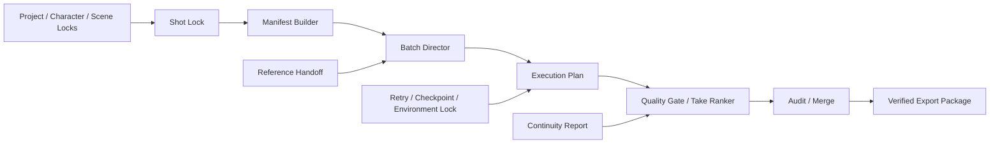

<p align="center">
  
</p>

<p align="center">
  <strong>Deterministic continuity planning, quality control, and production reliability for ComfyUI video workflows.</strong>
</p>

<p align="center">
  <a href="https://github.com/xinjian0101/continuity-director/actions/workflows/ci.yml"></a>
  
  
  
  <a href="https://github.com/xinjian0101/continuity-director/stargazers"></a>
  <a href="https://github.com/xinjian0101/continuity-director/issues"></a>
  
  <a href="LICENSE"></a>
</p>

<p align="center">
  <a href="#project-stewardship">Stewardship</a> ·
  <a href="#ecosystem-value">Ecosystem</a> ·
  <a href="#production-workflow">Workflow</a> ·
  <a href="#node-map">Nodes</a> ·
  <a href="#installation">Install</a> ·
  <a href="#documentation">Docs</a> ·
  <a href="https://github.com/xinjian0101/continuity-director/issues/new/choose">Issues</a>
</p>

---

# Continuity Director

Continuity Director is a public, installable ComfyUI custom-node package for repeatable AI video production. It converts project rules, identity constraints, scenes, shots, references, quality metrics, execution dependencies, approvals, retry plans, checkpoints, environment records, and export state into structured, traceable production data.

> [!IMPORTANT]
> Continuity Director does not replace a video model and cannot guarantee pixel-perfect identity. It controls production inputs and decisions so drift, failed handoffs, and inconsistent runs can be detected and corrected systematically.

## Project stewardship

| Item | Status |
|---|---|
| Repository visibility | Public |
| Primary maintainer | [@xinjian0101](https://github.com/xinjian0101) |
| Maintenance model | Active maintainer-led open source |
| Current line | `0.8.x` maintained preview |
| Governance | [GOVERNANCE.md](GOVERNANCE.md) |
| Maintainer responsibilities | [MAINTAINERS.md](MAINTAINERS.md) |
| Public roadmap | [ROADMAP.md](ROADMAP.md) |
| Release process | [docs/RELEASING.md](docs/RELEASING.md) |
| Security policy | [SECURITY.md](SECURITY.md) |
| Adoption evidence | [docs/ADOPTION.md](docs/ADOPTION.md) |

The project uses public Issues, pull requests, CI, changelog entries, release automation, scheduled maintenance checks, and Dependabot updates as verifiable maintenance records.

## Ecosystem value

Continuity Director solves a model-agnostic infrastructure problem around AI video generation: production teams need repeatable continuity state, shot handoffs, quality decisions, recovery controls, collaboration records, and portable outputs even when the underlying video model changes.

Primary use cases include:

- Multi-shot AI video planning and continuity control.
- Character, wardrobe, scene, and camera-state locking.
- Deterministic storyboard-to-Take expansion.
- Quality gating, Take ranking, and exact-path comparison.
- Batch execution planning, retry schedules, and resumable checkpoints.
- Collaboration, audit records, and verified production packages.

See [Ecosystem Value](docs/ECOSYSTEM.md) for users, integrations, boundaries, and non-goals.

## At a glance

| Capability | Included in v0.8.20 |
|---|---|
| ComfyUI nodes | 20 registered nodes across 7 production stages |
| Interface | Native production dashboard and reliability sidebar |
| Languages | English, Simplified Chinese, and bilingual display modes |
| Workflow acceleration | One-click connected starter chain |
| Reliability | Hash verification, schema migration, retry policy, checkpoints, and environment locks |
| Validation | Python 3.10–3.12 CI, lifecycle smoke tests, unit tests, frontend tests, ZIP validation, and maintainer-health checks |
| Runtime dependencies | No mandatory third-party Python packages |

## Production workflow



The dashboard action **Add starter chain** inserts and connects the primary production path automatically.

## Node map

| Stage | Nodes | Purpose |
|---|---:|---|
| Continuity locks | 5 | Project, character, scene, shot, and manifest state |
| Directing | 2 | Storyboard expansion and reference handoff |
| Quality | 3 | Thresholds, Take ranking, and continuity comparison |
| Runtime | 1 | Dependency-safe execution waves |
| Collaboration | 2 | Audit events and revision-safe merge |
| Export | 1 | Portable verified production package |
| Reliability | 6 | Verification, migration, retries, checkpoints, idempotency, and environment lock |

<details>
<summary><strong>Complete 20-node catalog</strong></summary>

- `CDProjectLock`
- `CDCharacterLock`
- `CDSceneLock`
- `CDShotLock`
- `CDManifestBuilder`
- `CDBatchDirector`
- `CDReferenceHandoff`
- `CDQualityGate`
- `CDTakeRanker`
- `CDContinuityReport`
- `CDExecutionPlan`
- `CDAuditEvent`
- `CDThreeWayMerge`
- `CDExportPackage`
- `CDVerifyPackage`
- `CDMigratePayload`
- `CDRetryPolicy`
- `CDQueueCheckpoint`
- `CDIdempotencyKey`
- `CDEnvironmentLock`

</details>

## Installation

From `ComfyUI/custom_nodes`:

```bash
git clone https://github.com/xinjian0101/continuity-director.git ComfyUI-ContinuityDirector
```

Restart ComfyUI, then search for node names beginning with `CD ·` or open the **Continuity Director** sidebar.

### Update an existing installation

```bash
cd ComfyUI/custom_nodes/ComfyUI-ContinuityDirector
git pull
```

### Build an installable ZIP

```bash
python scripts/build_release.py
```

The archive is created at `dist/continuity-director-v0.8.20.zip`.

## First production run

1. Open the **Continuity Director** sidebar.
2. Select English, 中文, or bilingual mode.
3. Click **Add starter chain**.
4. Configure Project, Character, Scene, and Shot locks.
5. Build a manifest and provide storyboard JSON to Batch Director.
6. Generate an execution plan.
7. Apply quality and reliability nodes before exporting the package.

Example input files are available in [`examples/`](examples/).

## Validation

```bash
python -m compileall -q .
python scripts/smoke_import.py
python scripts/maintainer_health.py
PYTHONPATH=tests python -m unittest discover -s tests -p "test_*.py"
python scripts/validate_release.py
python scripts/build_release.py --check
node tests/frontend_smoke.mjs
node tests/reliability_frontend_smoke.mjs
```

## Documentation

| Document | Purpose |
|---|---|
| [Documentation hub](docs/README.md) | Entry point for users and contributors |
| [Architecture](docs/ARCHITECTURE.md) | Modules, data flow, and execution boundaries |
| [Interface rules](docs/INTERFACE.md) | Dashboard behavior and localization requirements |
| [Ecosystem value](docs/ECOSYSTEM.md) | Use cases, beneficiaries, integrations, and non-goals |
| [Adoption evidence](docs/ADOPTION.md) | Privacy-safe usage and compatibility evidence |
| [Release process](docs/RELEASING.md) | Release readiness, validation, publication, and rollback |
| [Maintainers](MAINTAINERS.md) | Ownership and response targets |
| [Governance](GOVERNANCE.md) | Issue, review, decision, release, and security process |
| [Roadmap](ROADMAP.md) | Public release and adoption priorities |
| [Contributing](CONTRIBUTING.md) | Development workflow and pull-request checklist |
| [Security policy](SECURITY.md) | Supported versions and vulnerability reporting |
| [Support](SUPPORT.md) | Installation and troubleshooting guidance |
| [Changelog](CHANGELOG.md) | Release and maintenance history |

## Compatibility and security

- Python 3.10–3.12 is tested in CI.
- Imported JSON is treated as declarative data and is not executed.
- Production packages must not contain API keys or credentials.
- Integrity hashes detect changes; they are not an access-control mechanism.
- External models, operating systems, ComfyUI installations, and third-party nodes remain separate trust boundaries.

## Contributing

Bug reports, compatibility reports, adoption reports, documentation fixes, and focused feature proposals are welcome. Start with [CONTRIBUTING.md](CONTRIBUTING.md), review [CODE_OF_CONDUCT.md](CODE_OF_CONDUCT.md), and use the structured [Issue forms](https://github.com/xinjian0101/continuity-director/issues/new/choose).

## License

Released under the [MIT License](LICENSE).
