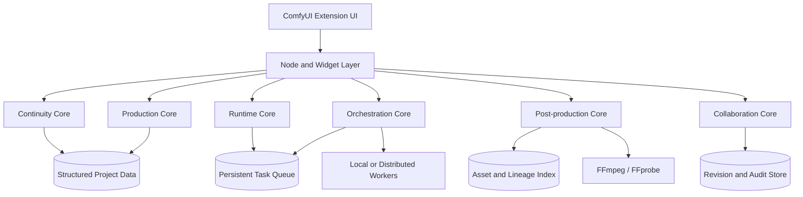

# Architecture

Continuity Director separates production data, orchestration, collaboration, post-processing, and interface concerns so that workflows remain reproducible and testable.

## System layers



## Core responsibilities

| Module | Responsibility |
|---|---|
| `continuity_core.py` | Characters, cast, costumes, props, locations, shots, states, seeds, and continuity rules |
| `production_core.py` | Storyboards, take variants, reference selection, quality decisions, and production packages |
| `runtime_core.py` | Persistent tasks, leases, retry state, execution records, and recovery |
| `orchestration_core.py` | Dependency planning, execution waves, worker matching, and capacity scheduling |
| `postprocess_core.py` | Probe, frame extraction, assembly, snapshots, diffs, rollback, and lineage |
| `collaboration_core.py` | Roles, edit locks, revisions, reviews, change requests, merge conflicts, and audit chains |
| `nodes.py` | ComfyUI node registration and stable public node interfaces |
| `js/` | User interface extensions, localization, panels, and client-side interaction |

## Data principles

1. Stored data uses stable machine-readable keys.
2. Interface language never changes stored workflow values.
3. Revisions are explicit and stale writes are rejected.
4. Imported manifests are schema-validated.
5. Execution state is recoverable after interruption.
6. Generated assets retain source, take, model, workflow, and revision lineage.
7. Audit events are append-oriented and hash-linked where required.

## Execution model

A production request is transformed into a deterministic execution plan:

```text
validated project state
  → shot and take expansion
  → dependency graph
  → compatibility and generation gates
  → worker assignment
  → task lease
  → generation or post-processing
  → technical and continuity review
  → asset registration
  → audit event
```

Task ordering may be parallelized only when declared dependencies allow it. Queue display order and scheduling priority must remain separate concepts.

## Extension boundaries

Continuity Director may integrate with external models or metrics through declared configuration and normalized results. It must not execute arbitrary code contained in imported JSON or store credentials inside reusable project packages.

## Compatibility

Public node identifiers and workflow keys should remain stable across minor releases. When a breaking change is unavoidable, include:

- A schema version change
- A migration function
- A compatibility note
- Regression tests using older workflow fixtures

## Testing strategy

The test suite should cover:

- Schema validation
- Deterministic serialization
- Revision conflicts
- Edit-lock expiry
- Queue recovery
- Worker heartbeat expiry
- Dependency scheduling
- Reference selection
- Quality-gate decisions
- Asset lineage
- Audit-chain verification
- Localization fallback
- Release package validation
